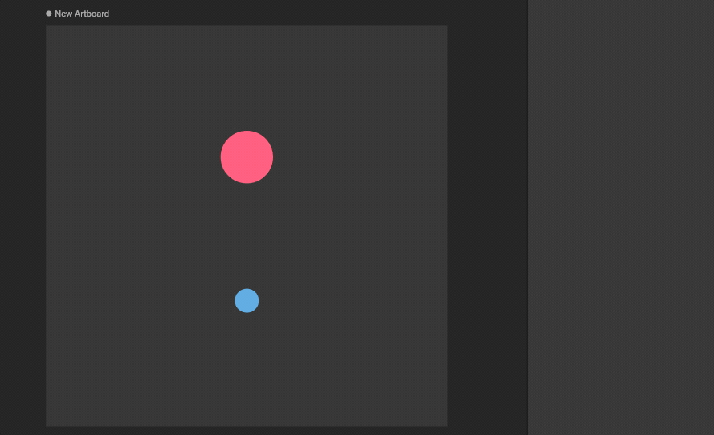
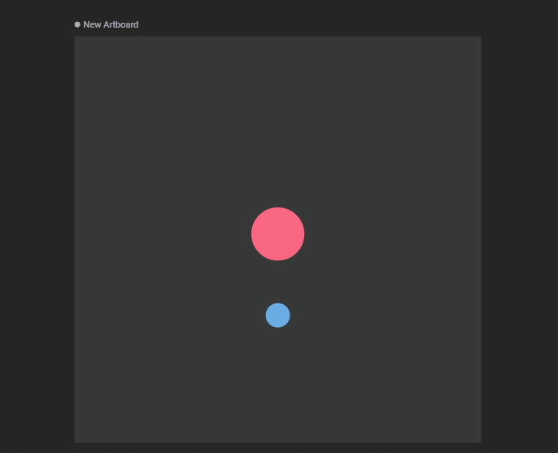

# Distance Constraint

The Distance Constraint makes an object stay close, far, or exactly at a specific distance to another object.

## How to create a Distance Constraint

### 1. Add a Distance Constraint to an object

Use the Constraints section of the Inspector to add a Distance Constraint to an object.

### 2. Choose a target

Use the new constraint's fly-out menu to select a target for this constraint.

### 3. Test that the Distance Constraint is working

Moving the target object now causes the constrained object to stay close \(which is the default [mode](distance-constraint.md#mode)\).

## Strength 

The Strength property determines how much the constrained object is affected.

A Strength of 0% means the constraint won't have any effect.

## Distance 

The distance that the object will be constrained from the target object. A red constraining circle is drawn on the stage to represent this value.

## Mode 

### Closer 

The owner is constrained closer than the Distance setting. In other words, the owner is constrained inside the constraining sphere.

### Further 

The owner is constrained further than the Distance setting. In other words, the owner is constrained outside the constraining sphere.

### Exactly 

The owner is constrained exactly at the distance of the constraining sphere.

