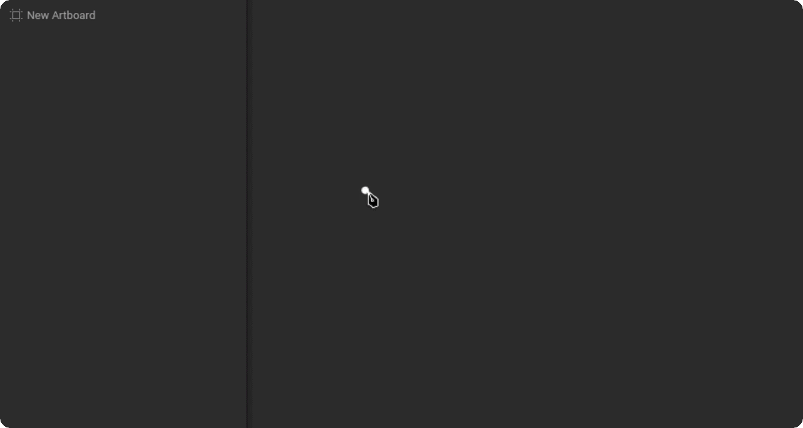
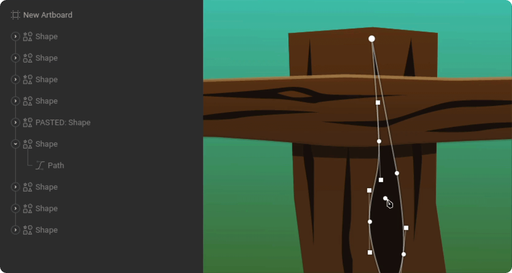
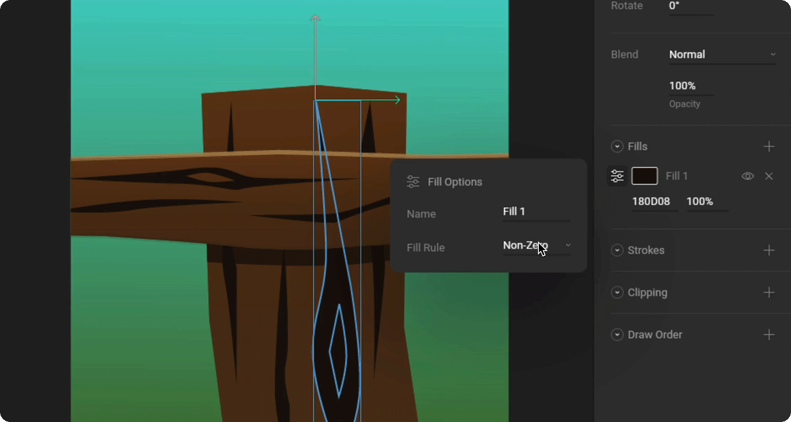

# Pen Tool Tips

## Using the pen tool

The Pen tool is a great way to build complex shapes and paths, but it's not always the most simple tool. Here are a few things to keep in mind when using the pen tool that will help you get started.

To learn more about the Pen tool, watch our video on the Pen tool or read below.

To learn more about the Pen tool, watch our video on the Pen tool or read below.



### Click for straight edges

If you want to make a path that only has straight edges, click your mouse to place each vertex.

### Drag for curved edges

If you want to create curved edges, click and drag your mouse as you place the vertex. The longer you drag the mouse, the more exaggerated the curve will be. If you want to create a straight edge from a curve, click to add your next vertex.

## Using multiple paths

When using procedural shapes, adding multiple paths to a shape layer is straightforward. You simply need to know that the Even-Odd draw rule doesn't create holes at a path intersection and Non-Zero does. When using paths created by the Pen tool, however, things get a bit tricky.

### Winding

You'll notice that as you create paths with the Pen tool, the first vertex in a path is represented by an arrow. This arrow indicates the winding of the path, which will be important depending on the Draw Rule you've set for your shape.

If you ever need to reverse the windings of the path, you can do this by finding the Reverse Direction button while Edit Vertices mode is active.

### Change first vertex

Change which vertex is considered the first vertex by right-clicking on the desired vertex and hitting the Make First Vertex button. This is useful when you want to open your path at a specific location.

### Non-Zero

Non-Zero takes into account the winding of a path, or the direction that the path is created \(clockwise or counterclockwise\). 

If two overlapping paths are created in the same direction and the draw rule is set to Non-Zero, you'll see that where they intersect is filled.

If two overlapping paths are created in opposite directions, you'll see that where they intersect is not filled.

We can use this to our advantage if we want to punch a hole in another shape without using clipping.

### 

### Even-Odd

Even-Odd is a bit easier to understand because you don't need to think about the direction in which a path is created. 

When two paths overlap, you'll see that there is no fill.

