# Tom Morello

## Intro

In this tutorial, we'll look at an advanced file and look into some of the techniques used. While we won't build the file step by step, we will examine the design, rig, animations, and state machine. For a more in-depth look, dive into the source file and look around.

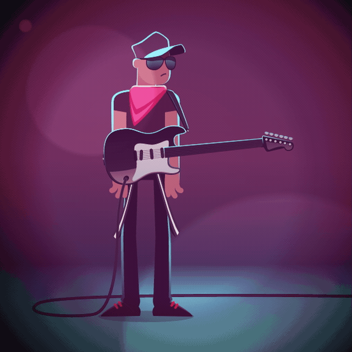

## Design

### 1. Use simple shapes

Notice the majority of the character uses simple shapes.

 (1).gif>)

The arms and legs have additional vertices added to account for the knees and elbows.

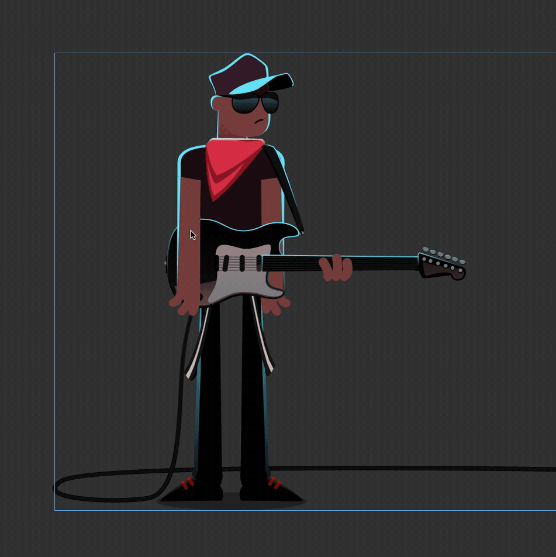

[Strokes](../editor/fundamentals/fill-and-stroke/#stroke) with [rounded end caps](../editor/fundamentals/fill-and-stroke/#cap) are used to create the fingers.

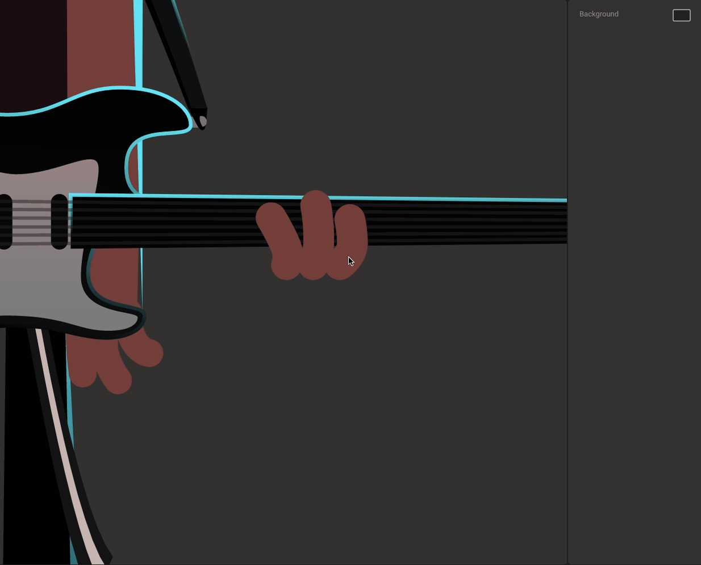

Notice the guitar cable is split into multiple shapes to give the cable a 3D effect.

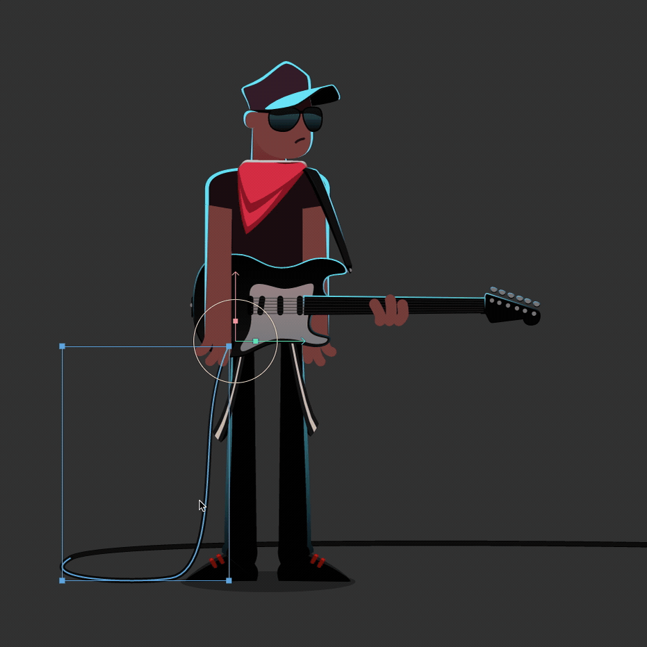

### 2. Rim lighting

Rim lighting helps your character stand out in the composition.

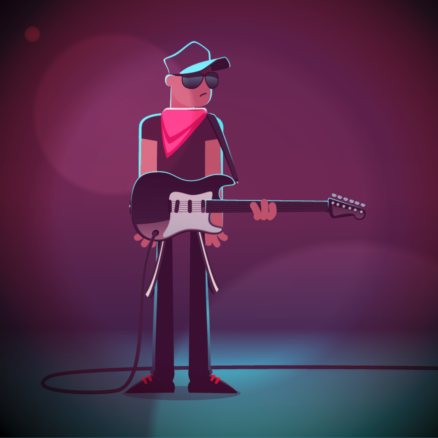

Duplicate shapes and change their color to easily light one or multiple sides.

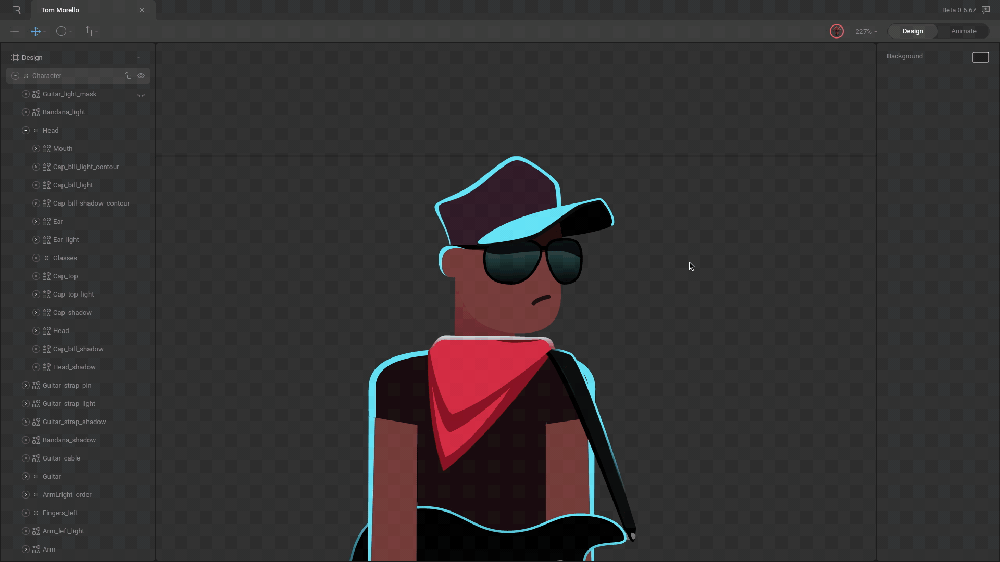

Use gradient strokes on your shapes. As the light falls off, turn down the opacity or select a darker color.

### 3. Background & effects

Use gradients with multiple stoppers to create a base for the background.

Use blend modes to create unique effects such as lens flares, color shifts, and framing.

.gif>)

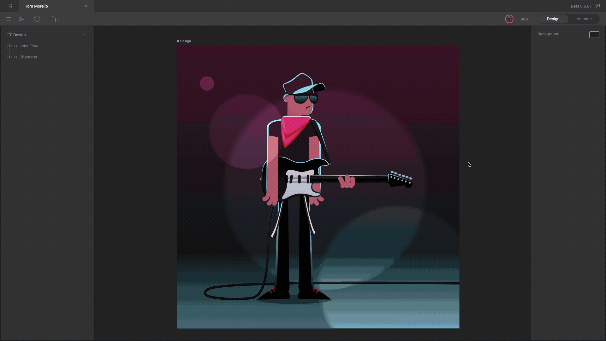

## Rigging

Start with a basic skeleton.

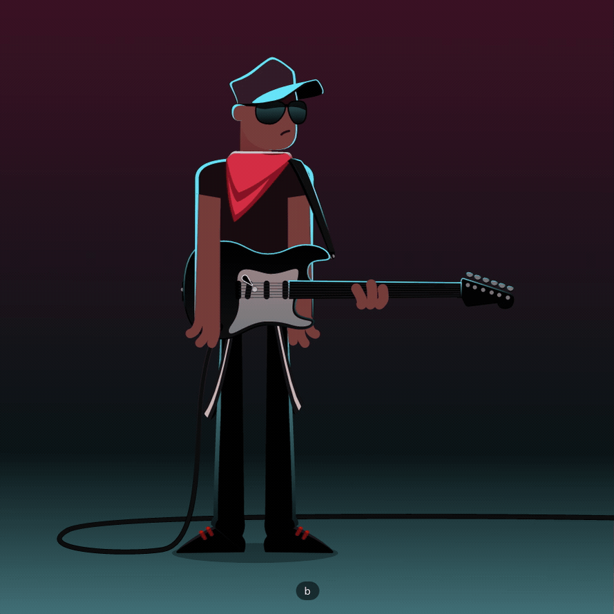

Add in additional bones for accessories.

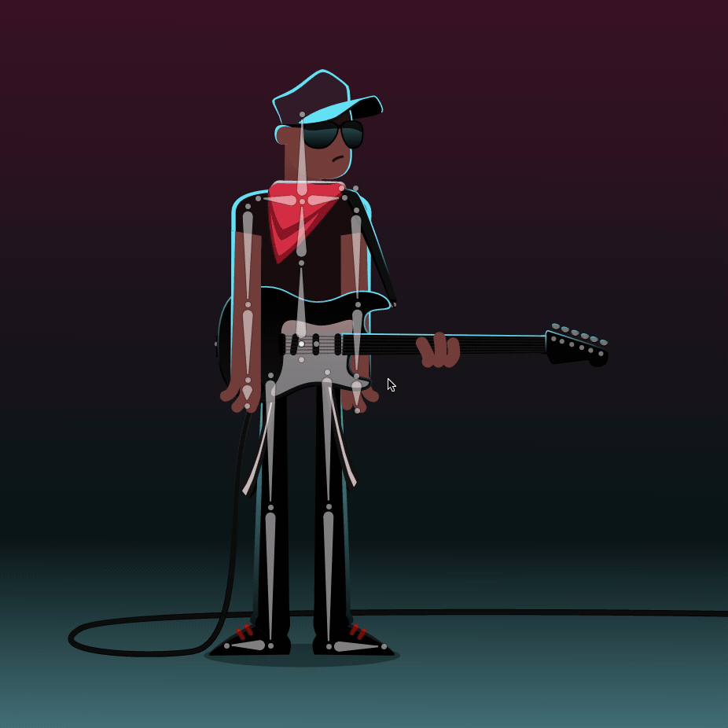

Ensure the bones have the proper hierarchical relationships.

.gif>)

Set up [IK constraints](../editor/constraints/ik-constraint.md) to make controlling the legs easier.

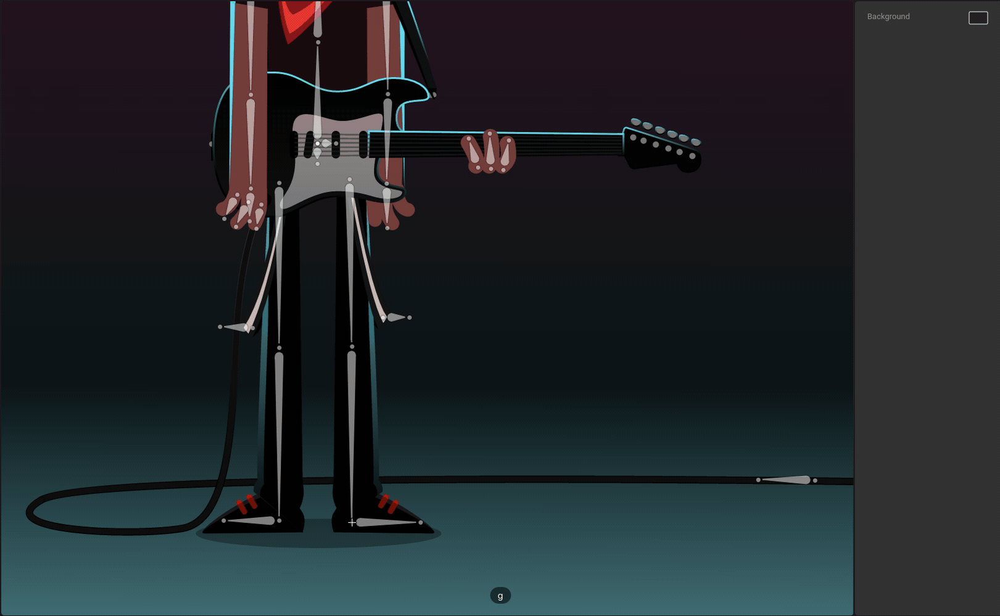

For the best performance, [bind and weight](../editor/manipulating-shapes/bones/#2-binding) only the shapes that will be influenced by two or more bones.&#x20;

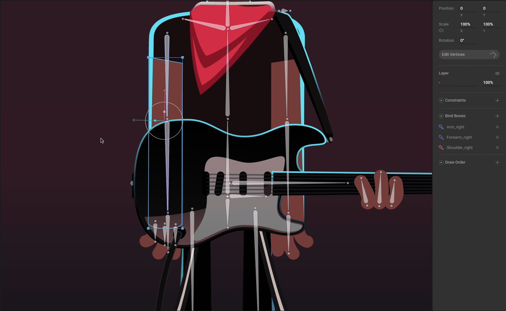

Use [parent-child relationships](../editor/manipulating-shapes/bones/#1-hierarchical-relationships) for shapes or groups that only use a single bone.

 (1).gif>)

Ensure all objects are nested under a Root group before animating. This group will allow you to control the transform properties of the entire composition, even if you've already added some animations.

 (1).gif>)

## Animation

Animate the idle first. Let the control bone do most of the work.

Add secondary motion to make the animation more interesting.

.gif>)

If you are planning on using the animation in the [state machine](../editor/state-machine.md), be sure to key all objects (bones, shapes, paths, ect...) in their current position. This will ensure the character can return to the proper pose when switching between states.

.gif>)

Use the bones to help you achieve the proper poses, then edit the timing.

 (1).gif>)

Once you are happy with the main poses and timing, add in secondary motion.

## State Machine

Create a new state machine with the plus button in the animations list.

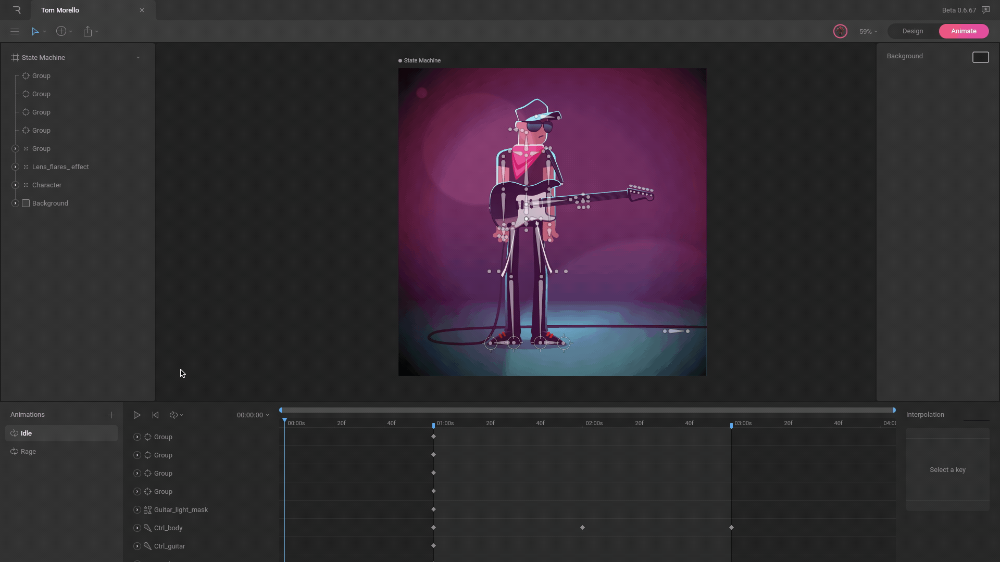

Drag your animations onto the graph.

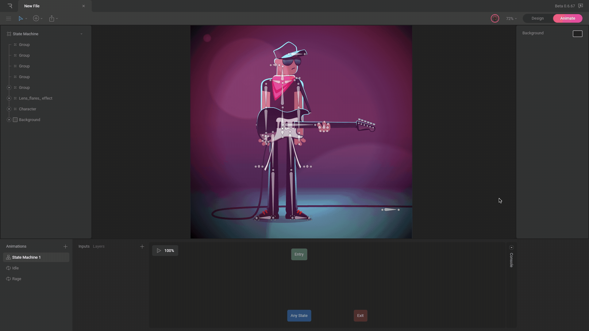

Add [transitions](../editor/state-machine.md#create-transitions).

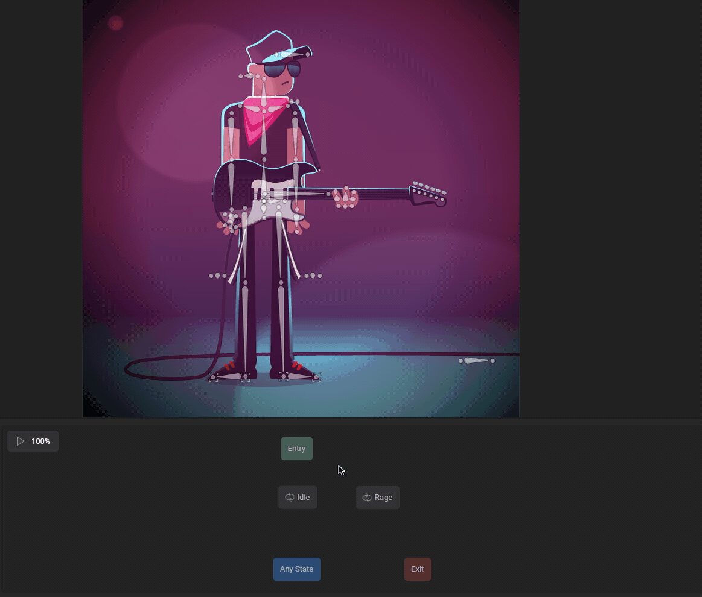

Add an [input](../editor/state-machine.md#inputs).

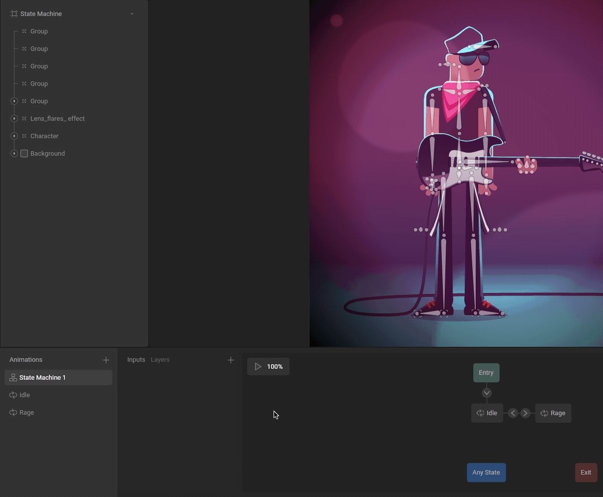

Configure transition [conditions](../editor/state-machine.md#conditions).

.gif>)

Test and make any changes necessary.

